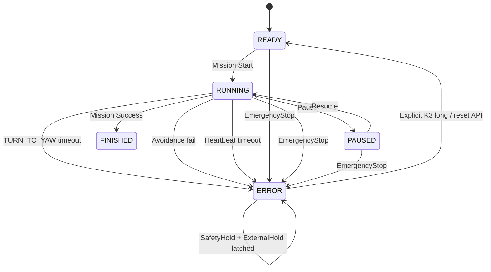

# 电赛小车 P0、P0.5、P1 第一阶段实施报告

> 实施日期：2026-07-20
> 实施范围：P0 基线冻结、P0.5 三项立即安全修复、P1 故障/快照/遥测基础设施、调度统计。
> 明确未实施：硬件 PWM、编码器方向修改/速度闭环、MotorControl、LineControl、IMU 拆层、SafetySupervisor 全量重构、Flash 参数持久化、正式地图修改。

## 1. 实施结论

本轮已完成源码实施并通过 TI Arm Clang 全源码语法检查和独立全量链接检查。

- P0：创建基线提交 `d637eb6` 和标签 `p0-baseline-20260720`。
- P0.5-1：`TURN_TO_YAW` 底层增加独立 elapsed/timeout，普通任务使用动作 timeout，固定绕障使用 `AppConfig.yaw_turn_timeout_ms`。
- P0.5-2：避障所有失败入口统一进入 `avoid_fail()`，保持 SafetyHold、冻结任务、切 `MISSION_STATUS_ERROR/CAR_STATE_ERROR`，保存故障码、底层 detail 和失败阶段。
- P0.5-3：增加软件急停锁存、主循环 heartbeat、软件超时停车路径和硬件 watchdog 封装骨架；硬件 WWDT 因当前 SysConfig 未分配资源，明确保持关闭。
- P1：增加统一 `FaultCode/FaultRecord`、`RuntimeSnapshot`、10 Hz `DebugTelemetry` 抽象及 OLED fault 简码。
- 调度：20 ms due 从 bool 改为 pending 计数；积压时只执行一次最新控制更新，其余记为 drop；使用真实 start-to-start elapsed，最大钳位 100 ms。

## 2. 修改前问题证据

### 2.1 TURN_TO_YAW 只有动作层 timeout，底层无 timeout

修改前真实调用链：

```text
普通任务:
MissionManager_Update_20ms
  -> MotionAction_Update_20ms
     -> motion_action_check_timeout(action->timeout_ms)
  -> CarController_Update_20ms
     -> handle_turn_to_yaw()     // 无 elapsed 增加、无 timeout 判断

固定绕障:
ObstacleAvoidance_Update_20ms
  -> CarController_StartTurnToYawRelative(angle)
  -> CarController_Update_20ms
     -> handle_turn_to_yaw()     // 完全绕过 MotionAction timeout
```

因此普通任务通常能被动作层 timeout 保护，但固定绕障的 TURN_OUT/TURN_TO_LINE 没有 timeout，方向、IMU 标度或机械状态异常时可能无限原地旋转。

### 2.2 避障失败保持 RUN + 永久 Hold

修改前 `avoid_fail()` 只执行：

```text
CarController_Stop()
active=false
failed=true
MissionManager_SetExternalHold(true)
state=FAILED
```

没有设置 `CAR_STATE_ERROR`，没有设置 Mission ERROR，没有统一故障码，也没有保存失败阶段。`ObstacleSafety` 后续持续 Hold，表现为 OLED 仍显示 RUN 但车辆永久不动。

### 2.3 无 heartbeat、watchdog 和独立急停

修改前：

- SysTick 只生成 1 ms 时间和 5/10/20 ms due；不检查主循环存活。
- 主循环卡住时，10 kHz PWM ISR 仍按最后 duty 驱动。
- 没有 WWDT SysConfig 实例。
- K2 只实现 Start/Pause/Resume；没有区别于 Pause 的锁存急停。

### 2.4 调度积压不可观测

修改前：

- 20 ms 使用单个 `bool g_appUpdateDue`，无法区分一次 pending 与多次丢周期。
- 5/10 ms pending 上限为 2，但没有 missed/drop/overrun 统计。
- IMU、HeadingControl 和多个 elapsed 计数固定使用 20 ms/0.02 s。

## 3. 修改文件清单

### 3.1 P0 文档

- `P0基线与最小回归清单.md`：构建/Profile/参数/资源/问题/回归基线。
- `电赛小车工程化改造总体方案.md`：纳入 P0 基线提交。
- `P0-P1第一阶段实施报告.md`：本报告。

### 3.2 新增基础设施

| 文件 | 职责 |
|---|---|
| `fault.h/.c` | 统一 `FaultCode`、sticky `FaultRecord`、OLED 简码 |
| `emergency_stop.h/.c` | 软件急停锁存、立即停车、明确复位 |
| `watchdog_monitor.h/.c` | heartbeat、100 ms 软件超时、ISR 停车、硬件 watchdog 骨架 |
| `scheduler_monitor.h` | 系统时间和 5/10/20 ms 调度统计接口；实现在 `empty.c` |
| `runtime_snapshot.h/.c` | 汇总 P1 要求的运行时快照 |
| `debug_telemetry.h/.c` | 默认 10 Hz、非阻塞 TX ring、可选 UART backend |

### 3.3 修改现有源码

| 文件 | 修改内容 |
|---|---|
| `app_features.h` | 增加 telemetry UART 与硬件 watchdog 开关，默认关闭 |
| `app_config.h/.c` | 增加 yaw 转角 timeout、避障回线 timeout 及限幅 |
| `app.h/.c` | 真实 elapsed dt、故障/快照/遥测初始化和更新、急停/watchdog 短路 |
| `empty.c` | pending 计数、missed/drop/overrun、真实 elapsed、heartbeat tick/feed |
| `car_controller.h/.c` | 底层转角 timeout、控制器错误码、急停/watchdog 最终出口保护 |
| `motion_action.h/.c` | 传递动作 timeout、真实 elapsed、底层 timeout 映射 |
| `mission_manager.h/.c` | 真实 elapsed、外部故障入口、ERROR 状态禁止普通 Cancel 绕过复位 |
| `obstacle_avoidance.h/.c` | 统一失败入口、失败阶段/detail、回线 timeout、ERROR 升级 |
| `obstacle_safety.c` | 避障失败/急停/watchdog 时 Hold 不得被解除 |
| `menu.c` | K2 长按全局急停；K3 长按明确复位 |
| `oled_ui.c` | STATUS/OBS 页面显示 fault 简码、detail/stage |
| `vision_uart.c` | 仅在显式开关打开时，低优先级发送 telemetry ring |

### 3.4 确认未修改

以下关键文件与基线无 diff：

```text
motor.c / motor.h
encoder.c / encoder.h
mission_library.c / mission_library.h
empty.syscfg
```

因此本轮没有修改 `Motor_SetSpeed` 量纲、编码器 `abs()`、任务动作数组、正式地图或硬件外设分配。

## 4. 每个修改点的调用链

### 4.1 正常 20 ms 控制周期

```text
SysTick 形成 app pending
  -> main 原子取走全部 pending
     -> pending > 1: drop += pending - 1
     -> elapsed = now - last_start，clamp <= 100 ms
     -> App_Update_20ms(elapsed)
        -> Imu_Update(real dt)
        -> Key/Menu
        -> MissionManager_Update_20ms(elapsed)
           -> MotionAction_Update_20ms(elapsed)
        -> ObstacleSafety_Update_20ms()
        -> ObstacleAvoidance_Update_20ms(elapsed)
        -> CarController_Update_20ms(elapsed)
        -> RuntimeSnapshot_Update(now)
        -> DebugTelemetry_Update(now)
        -> OLED
     -> WatchdogMonitor_NotifyControlCycleComplete(now)
```

### 4.2 TURN_TO_YAW

```text
任务动作:
MotionAction_Start(action)
  -> CarController_StartTurnToYawRelative(angle, action->timeout_ms)

固定绕障:
ObstacleAvoidance TURN_OUT/TURN_TO_LINE
  -> CarController_StartTurnToYawRelative(
       angle, g_appConfig.yaw_turn_timeout_ms)

每次控制更新:
CarController_Update_20ms(elapsed)
  -> handle_turn_to_yaw(elapsed)
     -> elapsed 累加
     -> 保持原成功条件: |error| <= 5° 连续稳定 100 ms
     -> elapsed >= timeout:
        Motor_Stop
        feedback.operation_failed = true
        feedback.error_code = YAW_TURN_TIMEOUT
        Fault_Raise(YTO)
        CarState = ERROR
```

### 4.3 避障失败

```text
任一失败入口
  -> avoid_fail(fault_code, controller_detail)
     -> CarController_Stop
     -> CarController_SetSafetyHold(true)
     -> active=false, failed=true
     -> 保存 failure_code/failure_stage/failure_detail
     -> MissionManager_SetExternalHold(true)
     -> state=FAILED
     -> MissionManager_ReportExternalFailure(code)
        -> Mission status=ERROR
        -> CarState=ERROR
     -> Fault_Raise(code, detail, failed_stage)
```

### 4.4 软件急停

```text
K2 长按或直接调用 EmergencyStop_Trigger()
  -> latch active=true
  -> Motor_Stop（立即）
  -> SafetyHold=true
  -> Mission external failure + ERROR
  -> Fault=ESTP

之后所有路径:
App / MissionManager / MotionAction / ObstacleAvoidance /
CarController start 与最终 set_output_speed
  -> 检查 EmergencyStop_IsActive()
  -> 禁止运动目标重新生效

K3 长按或 EmergencyStop_Reset()
  -> 显式清锁存
  -> 清避障状态/故障
  -> 重置 CarController/Mission
  -> READY，保持停车，不自动续跑
```

### 4.5 heartbeat/watchdog

```text
正常控制周期完成
  -> WatchdogMonitor_NotifyControlCycleComplete(now)
     -> heartbeat 时间更新
     -> 未来硬件 WWDT feed 唯一允许位置

每 1 ms SysTick
  -> WatchdogMonitor_Tick1msFromIsr(now)
     -> age >= 100 ms
        -> latch tripped
        -> Motor_Stop（ISR 中最终安全动作）
        -> fault pending

主循环若恢复
  -> WatchdogMonitor_ApplyFaultIfNeeded()
     -> SafetyHold=true
     -> Mission/Car ERROR
     -> Fault=HBT
```

## 5. 新增接口定义

### 5.1 Fault

```c
void Fault_Init(void);
void Fault_Raise(FaultCode code, uint16_t detail, uint16_t context,
    uint32_t timestamp_ms);
void Fault_Clear(void);
const FaultRecord *Fault_GetRecord(void);
const char *FaultCode_ToShortString(FaultCode code);
```

当前主要 fault 简码：

| FaultCode | OLED | 含义 |
|---|---|---|
| `FAULT_CODE_TURN_YAW_TIMEOUT` | `YTO` | 底层 yaw 转角超时 |
| `FAULT_CODE_AVOID_TURN_OUT` | `AOUT` | 避障转出阶段失败 |
| `FAULT_CODE_AVOID_DRIVE_OUT` | `ADRV` | 避障外移阶段失败 |
| `FAULT_CODE_AVOID_TURN_TO_LINE` | `ALIN` | 避障转回线路阶段失败 |
| `FAULT_CODE_AVOID_REACQUIRE_SEARCH` | `ASRC` | 回线搜索失败/超时 |
| `FAULT_CODE_AVOID_REACQUIRE_SETTLE` | `ASET` | 回线稳定阶段失败 |
| `FAULT_CODE_APP_HEARTBEAT_TIMEOUT` | `HBT` | 主循环 heartbeat 超时 |
| `FAULT_CODE_SOFTWARE_EMERGENCY_STOP` | `ESTP` | 软件急停 |

### 5.2 EmergencyStop

```c
void EmergencyStop_Init(void);
void EmergencyStop_Trigger(void);
void EmergencyStop_Enforce(void);
void EmergencyStop_Reset(void);
bool EmergencyStop_IsActive(void);
```

### 5.3 WatchdogMonitor

```c
void WatchdogMonitor_Init(uint32_t now_ms);
void WatchdogMonitor_Tick1msFromIsr(uint32_t now_ms);
void WatchdogMonitor_NotifyControlCycleComplete(uint32_t now_ms);
void WatchdogMonitor_ApplyFaultIfNeeded(uint32_t now_ms);
void WatchdogMonitor_Reset(void);
bool WatchdogMonitor_HasTripped(void);
const WatchdogMonitorStatus *WatchdogMonitor_GetStatus(void);
```

### 5.4 Scheduler/时间

```c
uint32_t SystemTime_GetMs(void);
void SchedulerMonitor_GetStats(SchedulerStats *stats);
```

### 5.5 RuntimeSnapshot

```c
void RuntimeSnapshot_Init(void);
void RuntimeSnapshot_Update(uint32_t timestamp_ms);
const RuntimeSnapshot *RuntimeSnapshot_Get(void);
```

快照已包含：timestamp、car state、mission/action、action result、run mode、track raw/error、yaw/gyro、obstacle、SafetyHold、ExternalHold、avoid state、fault、TURN_TO_YAW elapsed/error、20 ms missed/drop/overrun、UART overflow、heartbeat/watchdog 状态。

### 5.6 DebugTelemetry

```c
void DebugTelemetry_Init(void);
void DebugTelemetry_Update(uint32_t timestamp_ms);
uint8_t DebugTelemetry_TryPopTxByte(uint8_t *byte);
const DebugTelemetryStatus *DebugTelemetry_GetStatus(void);
```

- 更新频率：100 ms，即 10 Hz。
- 不使用 `printf`，不在 ISR 格式化或发送。
- TX ring 非阻塞；满时只记 overflow。
- `FEATURE_DEBUG_TELEMETRY_VISION_UART=0` 为默认值。

当前 UART3 同时连接视觉设备并接收二进制协议，不适合默认主动发送周期文本。若要启用正式遥测，建议新增：

```text
1 个未占用 UART 外设
1 个 TX GPIO（只发遥测即可；交互命令需要再加 RX）
115200 8N1
非阻塞 TX IRQ 或 DMA（第一版可用主循环 FIFO budget）
与当前 PB2/PB3 UART3 物理链路隔离
```

## 6. 故障状态转换图



故障时输出规则：

```text
EmergencyStop / Watchdog / Avoid failure
  -> SafetyHold=true
  -> Motor_Stop
  -> Mission ERROR + ExternalHold
  -> 普通 Start/Resume/Cancel 不得解除
  -> 仅明确 Reset 回到 READY
```

## 7. 急停、超时、避障失败执行路径

### 7.1 TURN_TO_YAW 超时

1. Start 时锁定 target yaw 和 timeout。
2. 每次真实 elapsed 累加到 `turn_elapsed_ms`。
3. 原成功条件先判断，正常成功行为不变。
4. 未成功且 elapsed 达 timeout：立即 `Motor_Stop`。
5. `CarControllerFeedback` 报 `operation_failed/YAW_TURN_TIMEOUT`。
6. 普通任务映射为 `MOTION_RESULT_TIMEOUT + MOTION_ERROR_TURN_TIMEOUT`。
7. 固定绕障在下一次避障更新中转换为带阶段的 avoidance fault。

### 7.2 避障失败

覆盖入口：

- 底层 controller `operation_failed`。
- IMU 未就绪。
- TURN_OUT、DRIVE_OUT、TURN_TO_LINE 期间进入 ERROR。
- REACQUIRE_SEARCH 超过 `avoid_reacquire_timeout_ms`。
- REACQUIRE_SETTLE 再次丢线。
- 非法避障状态。

所有入口均进入统一 `avoid_fail()`，不会自动解除 Hold，也不会继续原任务。正常 `AVOID_STATE_COMPLETE` 仍保留 `MotionAction_ReapplyControllerTarget()` 恢复链。

### 7.3 软件急停

- 操作：任意页面 K2 长按约 800 ms。
- 复位：K3 长按。
- 参数页原 K2 长按“快速增加”被急停优先级取代；K2/K3 短按调参不变。
- 暂停恢复仍可用 K2 短按；普通 Pause 不等同急停。

### 7.4 主循环 heartbeat

- timeout：100 ms。
- 只有 `App_Update_20ms()` 返回后才更新 heartbeat。
- SysTick 不喂狗，只检查 age。
- 软件 heartbeat 超时后 ISR 直接清除电机输出。
- 硬件 WWDT 当前未启用；将 `FEATURE_HARDWARE_WATCHDOG` 改为 1 会触发编译期错误，防止在未分配 SysConfig WWDT 时误以为已有硬件保护。

## 8. 编译结果

### 8.1 P0 基线

```text
mingw32-make -j4 all
结果：diansaikaishi.out is up to date
基线 SHA-256：704EDEC6D1A1C0E8F8B85DFB4FEE6B17A0BF45BB531205BBA36CCD7A3B17D186
```

### 8.2 修改后检查

执行了两层检查：

1. 对工程根目录全部 `.c` 执行 TI Arm Clang `-fsyntax-only`。
2. 使用现有 `device.opt/device_linker.cmd/device.cmd.genlibs` 独立编译全部源码并链接。

结果：

```text
全源码语法检查：通过
独立全量链接：通过
临时固件大小：593540 bytes
临时固件 SHA-256：1B8EBC752234DEE0DE743A369AF29252AFCEBF711979683FDB2DCD1A8BED01F0
新增 error：0
warning：12，均为基线已有的比赛 Profile 未注册诊断任务数组 unused warning
```

仍建议在 CCS 中执行一次 Clean Project + Build Project，让 Managed Build 自动把新增 `.c` 纳入 Debug 生成清单。

## 9. 静态检查结果

- `git diff --check`：通过，无空白错误。
- `Motor_SetSpeed()` 唯一业务调用点仍在 `car_controller.c`。
- `motor.*`、`encoder.*`、`mission_library.*`、`empty.syscfg` 无 diff。
- 未出现 `FEATURE_HW_PWM`、`FEATURE_SPEED_LOOP`、`MotorControl`、`LineControl`、`ParamStore` 实施代码。
- 未修改循迹 `track_kp/track_kd` 默认值。
- 未修改任何任务动作数组。
- 未在 ISR 中引入 `printf` 或遥测格式化。
- 视觉 RX ISR 行为未改；telemetry backend 默认关闭。

## 10. 可执行测试步骤

### T1 TURN_TO_YAW 不可达目标超时

前置：架空车轮，开发 Profile，确认实体断电手段。

1. 临时把 `YAW_TURN_REVERSE_DIRECTION` 设为错误方向，或机械阻挡车体转动。
2. 运行 `TEST-YH`；不要把动作 timeout 设为 0 来规避测试。
3. 观察 `turn_to_yaw_elapsed_ms` 增长。
4. 达动作 timeout/配置 timeout 后确认：
   - PWM/方向输出清零；
   - `CarState=ERROR`；
   - `action_result=TIMEOUT`；
   - `fault_code=YTO`；
   - K2 Start/Resume 无法重新驱动。
5. K3 长按复位，确认回 READY 且不自动续跑。

通过标准：不存在超过 timeout 后继续旋转的路径。

### T2 避障失败进入 ERROR

方案 A：在 FIXED_BYPASS 回线搜索阶段始终不给中心传感器黑线。
方案 B：阻挡 TURN_OUT/TURN_TO_LINE，使底层 yaw timeout。

1. 开发 Profile 运行 `TEST-OBS-F`。
2. 触发障碍进入固定绕障。
3. 人为制造上述失败。
4. 确认：
   - `ObstacleAvoidance.failed=true`；
   - `state=FAILED`；
   - `failure_stage` 是实际失败阶段；
   - `MissionStatus=ERROR`、`CarState=ERROR`；
   - SafetyHold/ExternalHold 均为 true；
   - OLED 显示 `AOUT/ALIN/ASRC/ASET` 之一；
   - 清除障碍不会自动继续。

### T3 heartbeat 卡死模拟

1. 先让系统正常完成至少一次 20 ms 控制周期，使 `heartbeat_seen=true`。
2. 用调试器让主循环停在一个不会屏蔽 SysTick 的死循环，或临时注入主循环阻塞 >100 ms。
3. 确认约 100 ms 后电机 PWM 和方向输出被清零。
4. 恢复主循环，确认进入 `HBT` ERROR，不能自动运行。
5. K3 长按明确复位。

限制：若断点同时冻结 SysTick，软件 heartbeat 无法动作；这正是后续硬件 WWDT 必须补齐的原因。

### T4 软件急停

1. 在基础循迹或固定绕障任意运动阶段 K2 长按。
2. 确认立即停车，OLED 显示 `ESTP`。
3. 尝试 K2 短按、普通 Resume、清除障碍，确认均不能重新驱动。
4. K3 短按不得解除。
5. K3 长按后回 READY，仍保持停止；重新短按 Start 才能运行。

### T5 正常任务不回退

1. `TEST-BASIC`：SEEK → FOLLOW 正常。
2. `TEST-YH`：正常 TURN_TO_YAW 成功条件与角度表现不变。
3. DRIVE_HEADING_TIME：持续时间完成并推进下一动作。
4. `TEST-STOP`：障碍 Hold/清除恢复正常。
5. `TEST-OBS-F`：完整固定绕障完成后调用 `MotionAction_ReapplyControllerTarget()`，恢复原 FOLLOW。
6. Pause/Resume/Cancel/Reset 按 P0 清单回归。
7. 云台+视觉并行输入，观察 5/10/20 ms missed/drop/overrun 和 UART overflow。

## 11. 已完成测试与未完成实车测试

### 已完成

- Git 基线提交和 annotated tag。
- P0 基线构建检查。
- 全部 `.c` TI Arm Clang 语法检查。
- 独立全量编译和链接。
- `git diff --check`。
- 唯一电机输出调用点检查。
- 禁止文件/禁止模块 diff 检查。
- 调用点和接口签名完整性检查。

### 未完成

- TURN_TO_YAW 错方向/机械阻挡实车超时。
- 避障各阶段故障注入实车测试。
- heartbeat 超时示波器/逻辑分析仪停车延迟测试。
- 软件急停实际按键响应时间测试。
- STOP_ONLY/FIXED_BYPASS 全流程实车回归。
- 云台、视觉和底盘长时间并行压力测试。
- 硬件 WWDT 复位测试（本轮未启用）。
- 独立 Debug UART 硬件资源确认。

## 12. 当前风险

1. **硬件 watchdog 尚未启用**。当前软件 heartbeat 依赖 SysTick 正常运行；全局关中断、时钟停止或 CPU 锁死时不能替代 WWDT。
2. heartbeat ISR 能立即停车，但若主循环永不恢复，Fault/OLED 状态无法刷新；电机安全优先于可视化。
3. telemetry 默认不从视觉 UART 发送，因此当前 P1 可通过调试器读取 `RuntimeSnapshot`，但没有默认外部 10 Hz 物理输出。
4. K2 长按已全局改为急停，参数页失去 K2 长按快速增加；这是为保证急停不受页面状态影响的明确取舍。
5. 5/10 ms 云台/tracker 仍按原固定 dt 和 catch-up 算法运行；本轮只加统计，没有修改云台算法。
6. `App_Update_20ms` 的真实 elapsed 最大钳位 100 ms；超过部分记入 missed/drop/dt clamp，不让单次控制计算使用过大 dt。
7. 新增回线搜索 timeout 默认 5000 ms，需要实车确认不会误伤极端但可恢复的路线。
8. 当前错误复位会重置任务到 READY，不支持故障点续跑，符合本轮安全优先目标。

## 13. 回退方式

安全查看/新建回退分支：

```bash
git switch -c recovery/p0 p0-baseline-20260720
```

查看基线：

```bash
git show p0-baseline-20260720
```

如果本轮实现已经形成独立提交，推荐使用 `git revert <P0.5-P1提交>` 在当前分支生成反向提交；不要覆盖后续实车记录。

## 14. P2 是否具备进入条件

结论：**源码和调试基础设施已基本具备，但实车门禁尚未满足，不建议立即进入硬件 PWM 迁移。**

进入 P2 前至少完成：

- T1～T5 安全与正常链路实车回归。
- 示波器确认当前 100 Hz PWM 基线和急停清零延迟。
- 确认 TB6612 PWMA/PWMB 的真实引脚与可映射 Timer 通道。
- 确认 Timer 资源不与云台 STEP、舵机、超声波冲突。
- 明确硬件 WWDT 实例、时钟、超时、调试暂停和复位策略；建议在 P2 前先补完硬件 watchdog。
- 冻结本轮稳定提交/标签，并记录实车测试数据。

满足以上门禁后，P2 只能先做 `FEATURE_HW_PWM` 兼容迁移，保持 `Motor_SetSpeed(-1000..1000)` 签名和唯一出口不变。
